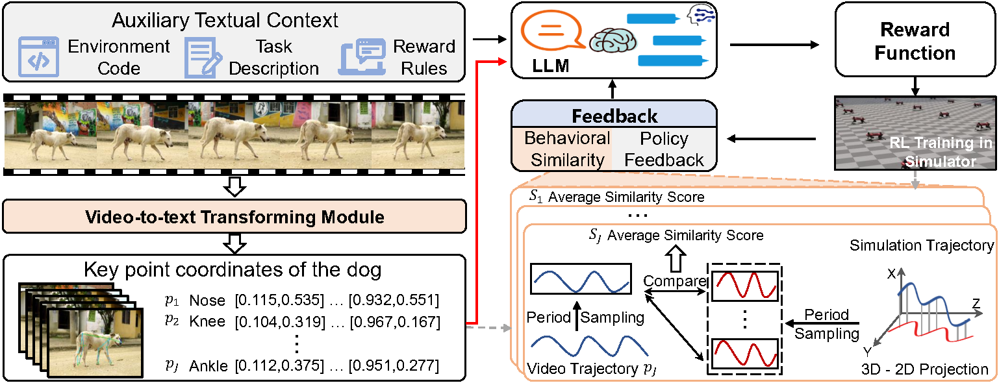

# Video2Reward: Generating Reward Function from Videos for Legged Robot Behavior Learning

[[Website]](https://djjiery.github.io/Video2Reward.github.io/) | [[PDF]](https://Video2Reward.github.io/pdf)

Learning behavior in legged robots presents a significant challenge due to its inherent instability and complex constraints. Recent research has proposed the use of a large language model (LLM) to generate reward functions in reinforcement learning, thereby replacing the need for manually designed rewards by experts. However, this approach, which relies on textual descriptions to define learning objectives, fails to achieve controllable and precise behavior learning with clear directionality. In this paper, we introduce a new **video2reward** method, which directly generates reward functions from videos depicting the behaviors to be mimicked and learned. Specifically, we first process videos containing the target behaviors, converting the motion information of individuals in the videos into keypoint trajectories represented as coordinates through a video2text transforming module. These trajectories are then fed into an LLM to generate the reward function, which in turn is used to train the policy. To enhance the quality of the reward function, we develop a video-assisted iterative reward refinement scheme that visually assesses the learned behaviors and provides textual feedback to the LLM. This feedback guides the LLM to continually refine the reward function, ultimately facilitating more efficient behavior learning. Experimental results on tasks involving bipedal and quadrupedal robot motion control demonstrate that our method surpasses the performance of state-of-the-art LLM-based reward generation methods by over 37.6\% in terms of human normalized score. More importantly, by switching video inputs, we find our method can rapidly learn diverse motion behaviors such as walking and running.
